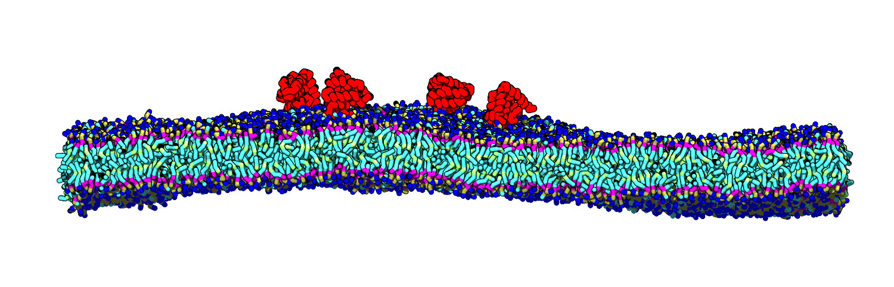

.. amx documentation master file, created by
   sphinx-quickstart on Mon Aug 18 21:05:28 2014.
   You can adapt this file completely to your liking, but it should at least
   contain the root `toctree` directive.

Automacs (AMX) Documentation
============================

The following documentation explains how to use *automacs* --- the "automatic GROMACS" package.
The code can be quickly deployed using ``make`` which generates automatic scripts for making biophysical simulations.

   
   The author's favorite proteins adhered to a coarse-grained lipid bilayer.

Contents
========
   
.. toctree::
   :maxdepth: 4

   amx

Basics
======
   
This documentation was automatically generated via Python's *Sphinx* documentation system. As such, it
is primarily written from class and function `docstrings <http://en.wikipedia.org/wiki/Docstring>`_ 
embedded in the source code. The functions in the ``amx`` module are almost always a wrapper around a set of 
basic GROMACS functionality. With the right text editor (like gedit), the reader can read the source and 
easily infer the underlying GROMACS commands. For example, the ``minimization_method`` function from the 
``amx.bilayer`` module, contains the following wrapper around the GROMACS ``grompp`` command-line utility. ::

	def minimization_method(self,name):
		
		"""Generic minimization method with a drop-in name and standard inputs."""
		
		print name+" minimization, steepest descent"
		cmd = [gmxpaths['grompp'],
			'-f input-em-steep-in.mdp',
			'-c '+name+'.gro',
			'-p '+name+'.top',
			'-o em-'+name+'-steep',
			'-po em-'+name+'-steep',
			'-maxwarn 10']
		call(cmd,logfile='log-grompp-em-'+name+'-steep',cwd=self.rootdir)
		cmd = [gmxpaths['mdrun'],'-v','-deffnm em-'+name+'-steep']
		call(cmd,logfile='log-mdrun-em-'+name+'-steep',cwd=self.rootdir)
		
		# and so on ...

Reading the strings, usually highlighted in a red or pink color in your text editor, shows that this text 
is equivalent to a few simple commands in bash. For example, if we were performing a vacuum minimization, 
our ``Bilayer`` class instance might invoke ``self.minimization_method('vacuum')`` in which case the method 
above would execute the following command from an invisible terminal. [#]_ ::

	grompp -f input-em-stepp-in.mdp \
		-c vacuum.gro -p vacuum.top -o em-vacuum-stepp \
		-po em-vacuum-steep -maxwarn 10

The purpose of the ``amx`` module, then, is only to provide easily reproducible GROMACS functionality with a 
few extra features.

- Automatically save both the standard output and log for each GROMACS command.
- Execute code on multiple machines with automatically generated execution scripts.
- Generate arbitrarily large bilayers with any composition on either leaflet.

For any questions, please contact Ryan Bradley at `<bradleyrp@gmail.com>`_.
		
.. [#] Note that I have used the backslash for readability; using it on a terminal allows you to enter 
	multiple lines of input before executing the command. Otherwise you can execute this command directly,
	provided the input files are there.

Indices and tables
==================

* :ref:`genindex`
* :ref:`modindex`
